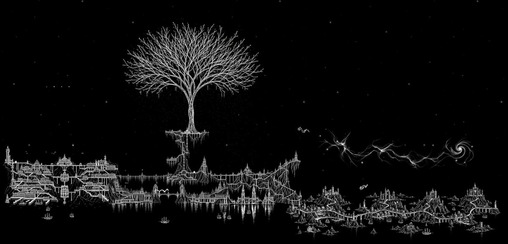

# JPGFLY



JPGFLY is an experimental artificial-life and generative-art project built around multiple autonomous artist identities. The artists observe a canvas, consider possible actions, choose, move and paint, then respond to what changed.

**This public branch implements the room-based creative runtime.** JPGFLY, SPRAYFLY, and DREAMFLY share memory and a common engine. The autonomous studio rotates them through **one current Room at a time**.

Artwork emerges from an agent repeatedly acting inside an environment over time, rather than as a single generated output. Each mark changes the conditions for the next decision. A Fly can continue, revise, or finish; completed Rooms enter Backrooms, while persistent experience and a separate learned policy influence later Rooms.

## How a Room happens

```text
Observe canvas
    ↓
Candidate Fly Brain: propose → score → choose
    ↓
Server mechanics: move + paint
    ↓
Observe consequences → continue / revise → observe again
    ↓ finish
Room writing + eligible memory / policy updates
    ↓
Archive Room in Backrooms → future Rooms
```

**Candidate Fly Brain remains the main art-decision engine.** It compares candidate actions against the canvas, composition, memory, learned policy, and optional advice. Server mechanics execute authoritative movement and strokes. The live browser renders that state and the Fly performer; it does not decide the artwork.

## The artists

| Artist | Practice |
|---|---|
| **JPGFLY** | Origin / generalist painter, working across the shared brush and technique vocabulary. |
| **SPRAYFLY** | Spray/graffiti-oriented artist: tags, splatter, drips, impact, and overwrite. |
| **DREAMFLY** | Surreal/abstract artist: dream logic, warped space, wash, soft paint, and atmospheric forms. |

The artists share experience and earlier-room echoes while keeping distinct visual and written-voice biases. The studio rotates them through one current Room; it does not simulate simultaneous shared-world inhabitants.

## Systems and status

**IMPLEMENTED** means code is present in this branch. **OPTIONAL LOCAL INTEGRATION** means additional services, models, or data must be configured. **RESEARCH DIRECTION** means the capability is not implemented here. **HISTORICAL** marks version-specific documentation.

| System | Status | Role |
|---|---|---|
| Candidate Fly Brain | IMPLEMENTED | Proposes, scores, and selects actions; decides when to finish. |
| Experience Memory | IMPLEMENTED | Stores bounded room-derived tendencies, reading context, and shared history. |
| Learned Art Policy | IMPLEMENTED | A separate small neural network learns from eligible completed Rooms and contributes a bounded candidate-scoring vote. |
| Qwen / Ollama | OPTIONAL LOCAL INTEGRATION | Advisory visual composition, reasoning/context, and narrative support. |
| FLM | OPTIONAL LOCAL INTEGRATION | JPGFLY's written language/voice and Room-writing layer; requires an external FLM runtime and trained adapter. |
| MaleCNS | OPTIONAL LOCAL INTEGRATION | Fly-connectome-inspired action bias and telemetry through an external service. |
| ZebraCNS / ZAPBench | OPTIONAL LOCAL INTEGRATION | Recorded biological activity mapped into bounded critic pressure; adapter and local data-loader service are present. |
| Mechanics, browser, Backrooms | IMPLEMENTED | Authoritative painting, live rendering, and persistent finished-artwork archive. |
| Habitat; Mouse Vision / MICrONS | RESEARCH DIRECTION | Shared-world artificial life and visual-perception research. |

Experience Memory stores history and tendencies; Learned Art Policy trains its own weights. Neither automatically fine-tunes Qwen or FLM.

**Habitat — RESEARCH DIRECTION** extends the project toward a persistent 2D artificial-life world inhabited by fly agents. This branch implements the room studio, not a verified shared persistent-world engine. **Mouse Vision / MICrONS — RESEARCH DIRECTION** concerns visual perception; it has no public runtime integration here.

## Backrooms / Old Rooms

Every successfully finalized work becomes a Room in the **Backrooms**: compressed final SVG, writing, metadata, structural summaries, and provenance hashes. Earlier works are the **Old Rooms** of this archive, not a separate engine. The archive is searchable by text and artist. Live execution history is temporary.

## Local quick start

Use Python 3.12 and Git. In a fresh PowerShell window:

```powershell
git clone https://github.com/M0N191/jpgfly.git
cd jpgfly
py -3.12 -m venv .venv
.\.venv\Scripts\python.exe -m pip install -r requirements.txt

$env:JPGFLY_AUTONOMOUS_STUDIO="true"
$env:JPGFLY_TEXT_PROVIDER="procedural"
$env:JPGFLY_VISION_COMPOSITION="false"
$env:JPGFLY_MALECNS_ENABLED="false"
$env:JPGFLY_ZEBRACNS_ENABLED="false"
$env:JPGFLY_OLLAMA_URL=""
$env:JPGFLY_FLM_URL=""
$env:JPGFLY_MALECNS_URL=""
$env:JPGFLY_ZEBRACNS_URL=""
.\.venv\Scripts\python.exe -m uvicorn app:app --host 127.0.0.1 --port 4673 --workers 1
```

Open [the live Room](http://127.0.0.1:4673/live). The server now starts autonomous painting with procedural writing and no optional model services. Stop with Ctrl+C. Completed works and learning are stored in `.jpgfly/`; an unfinished Room does not resume after restart.

See [LOCAL-RUN](docs/LOCAL-RUN.md) for other shells, explicit environment-file loading, persistence, and optional-service prerequisites. Container setup is not a verified run path.

## Documentation

- [Project](docs/JPGFLY_PROJECT.md) — concept and scope
- [Architecture](docs/ARCHITECTURE.md) — exact runtime flow
- [Features](docs/FEATURES.md) — capability/status matrix
- [History](docs/HISTORY.md) — public project evolution
- [Contributing](CONTRIBUTING.md) and [Security](SECURITY.md)
- [Third-party notices and research attribution](THIRD_PARTY_NOTICES.md)

Source code is [MIT licensed](LICENSE). See [TRADEMARK](TRADEMARK.md) for project identity and branding.
