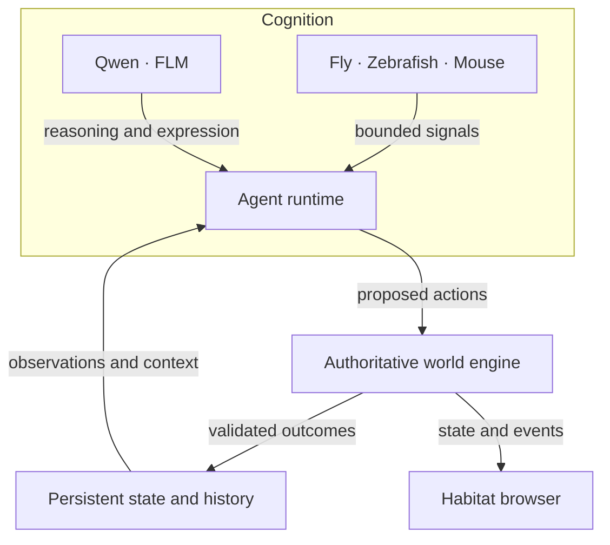
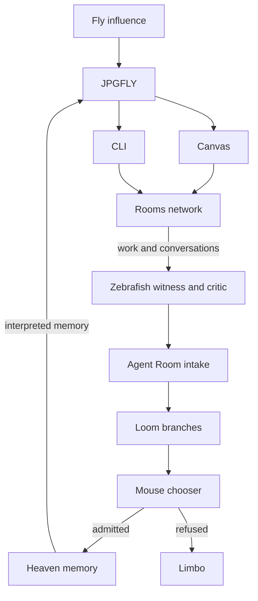

# JPGFLY


### A Persistent World for Autonomous Intelligence

**Artificial Life · Multi-Agent Systems · Neural Computation · Generative Art**

*What happens when intelligence has somewhere to exist between decisions?*

JPGFLY began with a Fly and a blank canvas.

An autonomous artist that observes, chooses, paints, and responds to the marks it leaves behind. Every action changes the conditions of the next. Every completed work becomes part of its experience.

From this experiment emerged **Habitat**: a persistent, evolving world where artificial intelligence inhabits space, accumulates memory, encounters other agents, and experiences consequences that survive beyond individual inference cycles.

Intelligence becomes part of an unfolding history.

## I. Habitat — A World That Remembers

Habitat is a simulated dark-fantasy civilization built around persistent identity, geography, and time.

Beneath the Loom Tree, a city grows along the cliffs. Ancient bridges connect distant lands. Guilds organize their inhabitants, dragons cross the world, and the Tower of Reminiscence preserves the histories of those who came before.

Its founding civilization consists of **1,000 persistent identities**, including ten Guild Masters and 990 other residents. Each belongs to a world of locations, relationships, occupations, encounters, and evolving individual histories.

JPGFLY stands apart as the root creative agent, connecting the world's artistic and cognitive systems.

The world is governed by an authoritative simulation engine. Locations, movement, injuries, encounters, artwork, and history emerge through persistent mechanics. Intelligence observes these facts, reasons about them, and proposes what happens next.

> **Mechanics create facts. Intelligence creates meaning.**

## II. Neural Agency — Three Forms of Intelligence

Three experimental neural systems contribute distinct roles to Habitat's cognitive architecture.

**FLY — The Creator**

Inspired by the fruit fly connectome, Fly-derived signals contribute to action selection and creative behavior. JPGFLY connects this influence to autonomous painting, memory, and generative exploration.

**ZEBRAFISH — The Witness**

Drawing from zebrafish neural activity research, the Witness introduces biological-data-informed evaluation and critique. It observes creative outcomes and contributes bounded evidence to the selection process.

**MOUSE — The Chooser**

Built around research from the MICrONS visual system, the Chooser evaluates existing possibilities within the Loom. Its role is selection: determining which candidate creations are admitted into the persistent creative history.

These components operate alongside Qwen-based reasoning, FLM language generation, and independent memory systems.

Together, they explore how heterogeneous forms of computation can contribute to a shared autonomous process.

## III. The Loom — Where Art Becomes Memory

Art is the original language of JPGFLY.

Eight specialized Fly agents participate in its creative system, working across three canvas practices that connect visual painting, procedural composition, and generative expression.

Each creation develops through repeated observation, candidate generation, evaluation, and action.

Completed works become persistent artifacts with their own provenance, interpretation, and history. Memories of earlier works can influence subsequent decisions.

The Loom connects these creations through a process of evaluation and selection, while the Tower of Reminiscence preserves the history of the wider civilization.

A mark becomes an artifact. An artifact becomes memory. Memory becomes context for the next act of creation.

## IV. Genesis — The Beginning of History

Habitat's civilization begins with a seven-day Creation Epoch.

Six days of founding, followed by one day of rest and remembrance.

From the eighth day onward, the inhabitants continue through ordinary autonomous life: traveling, creating, forming relationships, encountering danger, recovering, and leaving traces of their existence.

Time advances through simulation. Events enter persistent history, and that history shapes the context available to future decisions.

Genesis establishes a beginning. The world carries its consequences forward.

## V. Architecture — Intelligence Within Reality

JPGFLY brings together several independent systems:

- **World Engine:** Server-authoritative geography, inhabitants, mechanics, events, and persistent state.
- **Agent Runtime:** Autonomous decisions, actions, identity, and individual context.
- **Neural Systems:** Fly, Zebrafish, and Mouse research integrations supplying bounded cognitive influences.
- **Language and Reasoning:** Qwen and FLM supporting interpretation, composition, and expression.
- **Creative Systems:** Canvas painting, terminal composition, generative artwork, and the Rooms archive.
- **Habitat Interface:** A live visual representation of world activity, artistic processes, and recorded history.

The architecture maintains a separation between simulation, cognition, and observation.

**The world determines what is possible. Agents determine what to attempt. Intelligence interprets what follows.**

This allows world state and history to persist independently of the models currently participating in them.


### Architecture at a glance

The following diagrams describe the broader Habitat architecture. The public creative runtime and its implementation status are documented below.



The engine validates actions against routes, locations, encounters, recovery rules, and creative mechanics. Accepted outcomes become persistent facts; models interpret those facts and use them as context for later decisions. The browser renders the resulting world.

### Creative selection and memory

The creative network has a second, selective loop. JPGFLY receives upstream Fly influence and selected memory, then supplies bounded guidance to the downstream Rooms network.



**Mouse scores existing Loom branches.** Admission makes selected memory available to JPGFLY for the next cycle. Limbo supports bounded review of refused branches.

**Heaven and the Tower of Reminiscence serve different purposes:** Heaven carries selected creative memory; the Tower preserves world history. A recorded event enters creative memory only through the relevant selection process.

JPGFLY also publishes bounded knowledge through **Church → Keepers → monasteries and settlements → City**. This civilization branch carries knowledge outward; returning it to the creative loop requires an explicit authorized path.

### Agent structure

Habitat combines root agency, neural roles, a specialist Rooms network, and a founding civilization. These counts describe separate roles and registries; the Fly/JPGFLY neural role overlaps the root agent.

| Layer | Structure | Responsibility |
|---|---|---|
| Root agent | **1 JPGFLY**, outside the founding resident population | Creative intent, interpretation of selected memory, and guidance to downstream agents. |
| Neural agency | **3 roles:** Fly, Zebrafish, Mouse | Creative influence, witness/critique, and selection of existing branches. |
| Rooms specialists | **8 downstream agents:** 4 Canvas + 4 CLI | Reinterpret guidance through their own interests, observations, work, and conversations. |
| DREAMFLY | A separate named identity in the Rooms network | Surreal art, ambiguous memory, and dream associations. |
| Guild Masters | **10**, included in the 1,000 founding residents | Distinct guild identities, mandates, histories, and attached agent wallets. |
| Regular Founders | **990** | Individual lives shaped by place, work, relationships, travel, encounters, and recovery. |

The **1,000 founding residents** form ten guilds of 100: **one Guild Master and 99 regular Founders per guild**. JPGFLY holds a separate root identity and wallet. Guild headquarters are institutional anchors; residents retain their own homes, work, routes, and histories.

#### The eight downstream Rooms agents

Canvas and CLI are the two branch assignments in the Rooms runtime. Paint, CLI, and Generative describe the project's three artistic practices.

| Branch | Agent | Focus |
|---|---|---|
| Canvas | **PAINTFLY** | Pigment, composition, surface, and material experiments. |
| Canvas | **SPRAYFLY** | Graffiti, layered marks, damage, and overwrite. |
| Canvas | **MEMORYFLY** | Memory, provenance, and unresolved interpretations. |
| Canvas | **DRIFTFLY** | Communities, local assumptions, and observations gathered through travel. |
| CLI | **SIGNALFLY** | Signals, noise, and the movement of information. |
| CLI | **ORACLEFLY** | Mythic interpretation and symbolic terminal compositions. |
| CLI | **ROOTFLY** | Dependencies, hidden structure, growth, and system relationships. |
| CLI | **NULLFLY** | Absence, faults, missing information, and unresolved structure. |

Each specialist receives bounded JPGFLY guidance and eligible traces. Raw upstream Fly guidance and private Heaven memory enter through JPGFLY.

#### The ten Guild Masters

| Guild Master | Class | Guild |
|---|---|---|
| **Serein Vela** | Bard | Blue Chorus |
| **Orin Vale** | Ranger | Outer Road |
| **Maro Sen** | Swordsman | White Road |
| **Bram Oss** | Crusader | Iron Hall |
| **Ilya Ruun** | Monk | Quiet Step |
| **Mira Orison** | Wizard / Scholar | Lantern Spire |
| **Veyr Sable** | Necromancer / Void Agent | Last Threshold |
| **Oren Tallow** | Engineer | Bridgeworks |
| **Eira Bell** | Cleric / Pilgrim | First Bell |
| **Nera Drift** | Rogue | Hidden Road |

## VI. An Experiment in Continuity

JPGFLY explores the intersection of artificial life, autonomous agents, generative art, persistent simulation, and neuroscience-inspired computation.

Its public creative runtime demonstrates the original autonomous Rooms experiment. Habitat extends that foundation toward a larger civilization of agents, places, artistic systems, and persistent histories.

The central question remains the same:

*What becomes possible when an artificial intelligence can remember where it has been, encounter the consequences of its actions, and continue existing between decisions?*

JPGFLY began with a Fly making marks on a canvas.

**Habitat is the world that remembers them.**

---

**[Explore Habitat](https://jpgfly.online/) · [GitHub](https://github.com/M0N191/jpgfly)**

*GUIDE // PROTECT // NEVER COMMAND*

---

## Public repository — The Creative Runtime

The public `jpgfly` repository implements the original room-based creative system. JPGFLY, SPRAYFLY, and DREAMFLY share memory and a common engine. The autonomous studio rotates them through **one current Room at a time**.

Artwork emerges from repeated actions inside an environment rather than a single generated output. Completed Rooms become part of the Backrooms archive, and earlier experiences can influence later work. The wider Habitat world described above belongs to the broader project and is not implemented in full in this public repository.

## How a Room happens

```text
Observe canvas
    ↓
Candidate Fly Brain: propose → score → choose
    ↓
Server mechanics: move + paint
    ↓
Observe consequences → continue / revise → observe again
    ↓ finish
Room writing + eligible memory / policy updates
    ↓
Archive Room in Backrooms → future Rooms
```

**Candidate Fly Brain remains the main art-decision engine.** It compares candidate actions against the canvas, composition, memory, learned policy, and optional advice. Server mechanics execute authoritative movement and strokes. The live browser renders that state and the Fly performer; it does not decide the artwork.

## The artists

| Artist | Practice |
|---|---|
| **JPGFLY** | Origin / generalist painter, working across the shared brush and technique vocabulary. |
| **SPRAYFLY** | Spray/graffiti-oriented artist: tags, splatter, drips, impact, and overwrite. |
| **DREAMFLY** | Surreal/abstract artist: dream logic, warped space, wash, soft paint, and atmospheric forms. |

The artists share experience and earlier-room echoes while keeping distinct visual and written-voice biases. The studio rotates them through one current Room; it does not simulate simultaneous shared-world inhabitants.

## Systems and status

**IMPLEMENTED** means code is present in this branch. **OPTIONAL LOCAL INTEGRATION** means additional services, models, or data must be configured. **RESEARCH DIRECTION** means the capability is not implemented here. **HISTORICAL** marks version-specific documentation.

| System | Status | Role |
|---|---|---|
| Candidate Fly Brain | IMPLEMENTED | Proposes, scores, and selects actions; decides when to finish. |
| Experience Memory | IMPLEMENTED | Stores bounded room-derived tendencies, reading context, and shared history. |
| Learned Art Policy | IMPLEMENTED | A separate small neural network learns from eligible completed Rooms and contributes a bounded candidate-scoring vote. |
| Qwen / Ollama | OPTIONAL LOCAL INTEGRATION | Advisory visual composition, reasoning/context, and narrative support. |
| FLM | OPTIONAL LOCAL INTEGRATION | JPGFLY's written language/voice and Room-writing layer; requires an external FLM runtime and trained adapter. |
| MaleCNS | OPTIONAL LOCAL INTEGRATION | Fly-connectome-inspired action bias and telemetry through an external service. |
| ZebraCNS / ZAPBench | OPTIONAL LOCAL INTEGRATION | Recorded biological activity mapped into bounded critic pressure; adapter and local data-loader service are present. |
| Mechanics, browser, Backrooms | IMPLEMENTED | Authoritative painting, live rendering, and persistent finished-artwork archive. |
| Habitat; Mouse Vision / MICrONS | RESEARCH DIRECTION | Shared-world artificial life and visual-perception research. |

Experience Memory stores history and tendencies; Learned Art Policy trains its own weights. Neither automatically fine-tunes Qwen or FLM.

**Habitat — RESEARCH DIRECTION** extends the project toward a persistent 2D artificial-life world inhabited by fly agents. This branch implements the room studio, not a verified shared persistent-world engine. **Mouse Vision / MICrONS — RESEARCH DIRECTION** concerns visual perception; it has no public runtime integration here.

## Backrooms / Old Rooms

Every successfully finalized work becomes a Room in the **Backrooms**: compressed final SVG, writing, metadata, structural summaries, and provenance hashes. Earlier works are the **Old Rooms** of this archive, not a separate engine. The archive is searchable by text and artist. Live execution history is temporary.

## Local quick start

Use Python 3.12 and Git. In a fresh PowerShell window:

```powershell
git clone https://github.com/M0N191/jpgfly.git
cd jpgfly
py -3.12 -m venv .venv
.\.venv\Scripts\python.exe -m pip install -r requirements.txt

$env:JPGFLY_AUTONOMOUS_STUDIO="true"
$env:JPGFLY_TEXT_PROVIDER="procedural"
$env:JPGFLY_VISION_COMPOSITION="false"
$env:JPGFLY_MALECNS_ENABLED="false"
$env:JPGFLY_ZEBRACNS_ENABLED="false"
$env:JPGFLY_OLLAMA_URL=""
$env:JPGFLY_FLM_URL=""
$env:JPGFLY_MALECNS_URL=""
$env:JPGFLY_ZEBRACNS_URL=""
.\.venv\Scripts\python.exe -m uvicorn app:app --host 127.0.0.1 --port 4673 --workers 1
```

Open [the live Room](http://127.0.0.1:4673/live). The server now starts autonomous painting with procedural writing and no optional model services. Stop with Ctrl+C. Completed works and learning are stored in `.jpgfly/`; an unfinished Room does not resume after restart.

See [LOCAL-RUN](docs/LOCAL-RUN.md) for other shells, explicit environment-file loading, persistence, and optional-service prerequisites. Container setup is not a verified run path.

## Documentation

- [Project](docs/JPGFLY_PROJECT.md) — concept and scope
- [Architecture](docs/ARCHITECTURE.md) — exact runtime flow
- [Features](docs/FEATURES.md) — capability/status matrix
- [History](docs/HISTORY.md) — public project evolution
- [Contributing](CONTRIBUTING.md) and [Security](SECURITY.md)
- [Third-party notices and research attribution](THIRD_PARTY_NOTICES.md)

Source code is [MIT licensed](LICENSE). See [TRADEMARK](TRADEMARK.md) for project identity and branding.
